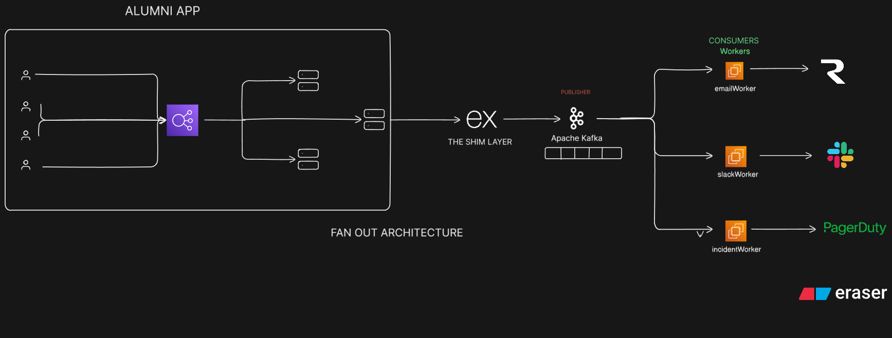

# Notification Microservice

A highly scalable, asynchronous notification microservice designed to handle multi-channel communications. Built with **Node.js** and **Apache Kafka**, this service acts as a centralized communication hub, decoupling notification logic from main application flows (such as the core alumni application).

By publishing events to Kafka, the system ensures zero-blocking on the main APIs and provides reliable "fan-out" delivery to Email, Slack, and Incident Management (PagerDuty) channels via dedicated background workers.

---

## System Architecture



### How it Works:

1. **Producer (API):** Client applications send a unified JSON payload to the `/notify` API endpoint. The API immediately acknowledges the request and pushes a message to a Kafka topic.
2. **Message Broker (Kafka):** Acts as the highly-available middleman, queuing the notification events.
3. **Consumers (Workers):** Independent Node.js worker processes (`emailWorker.js`, `slackWorker.js`, `incidentWorker.js`) listen to specific Kafka topics. When an event matches their designated channel, they process and dispatch the alert to the respective external provider.

---

## Technology Stack

* **Backend:** Node.js, Express.js
* **Message Broker:** Apache Kafka
* **Containerization:** Docker, Docker Compose
* **Workers:** Dedicated scripts for Email (SMTP), Slack (Webhooks/API), and Incidents (PagerDuty)

---

## Use Cases & Payload Examples

The service routes messages dynamically based on the `channels` array provided in the request payload. Here are three common scenarios for the alumni ecosystem:

---

### Use Case 1: Marketing / Event Announcement

**Scenario:** Notify alumni about an upcoming hackathon or meetup via Email and Slack.

```json
{
  "message_type": "announcement",
  "priority": "low",
  "channels": ["email", "slack"],
  "recipients": ["alumni.test@example.com"],
  "payload": {
    "title": "🎉 JECRC Alumni Hackathon 2026",
    "body": "Join us on campus next month for a 24-hour hackathon! Food and energy drinks provided."
  }
}
```

---

### Use Case 2: Internal System Warning

**Scenario:** Notify the dev team about a non-critical issue via Slack.

```json
{
  "message_type": "system_warning",
  "priority": "medium",
  "channels": ["slack"],
  "recipients": [],
  "payload": {
    "title": "Background Job Latency",
    "body": "The image upload processing queue is currently taking > 5 seconds per image."
  }
}
```

---

### Use Case 3: Critical Outage (3-Channel Fan-out)

**Scenario:** Alert engineers via PagerDuty, Slack, and Email during a major outage.

```json
{
  "message_type": "emergency",
  "priority": "critical",
  "channels": ["email", "slack", "incident"],
  "recipients": ["engineering.lead@example.com"],
  "payload": {
    "title": "DATABASE CONNECTION FAILED",
    "body": "The main MongoDB cluster is unreachable. User logins and data retrieval are currently failing. Immediate action required."
  }
}
```

---

## Local Setup & Execution

### Prerequisites

* Docker & Docker Compose
* Node.js (v18+)

---

### Running the Infrastructure

Start the entire stack (Zookeeper, Kafka, API server, and Workers):

```bash
docker-compose up -d --build
```

---

### Testing the API

Once the containers are running, hit the API:

```
http://localhost:<PORT>/notify
```

(Replace `<PORT>` with the value defined in your `api/index.js`)

Use Postman or cURL and pass any of the JSON payloads above.

---

## ⚠️ Final sanity checklist (do this once)

* File name MUST be: `README.md`
* No ```markdown at top (you’re safe now)
* Image `Architecture.png` exists in same folder

---
